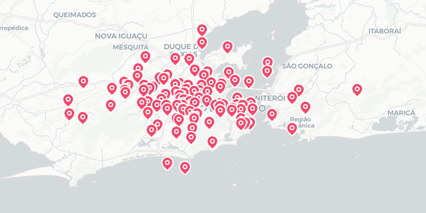

# 🗺️ Map Pins

<p align="center">
	
</p>


## 🚀 What is Map Pins?

**Map Pins** lets you create beautiful map pin images from your own CSV data. Use it as a slick Electron desktop app or instantly in your browser. Perfect for visualizing locations, planning routes, or sharing custom maps!

🗺️ **Try it live: [nalmeida.github.io/map-pins](https://nalmeida.github.io/map-pins/)**

_Built with [Maplibre GL JS](https://maplibre.org/), a free and open source mapping library._

---

## ✨ Features

- 📍 Generate map pin images from CSV files
- 🗺️ Visualize and export custom maps
- 💻 Electron desktop app for offline use
- 🌐 Web version for instant access
- ⚡ Fast, simple, and open source

---

## 💻 Electron App

Run Map Pins as a desktop application for a seamless experience.

### Getting Started

```bash
git clone https://github.com/nalmeida/map-pins.git
cd map-pins
npm install
npm start
```

#### Electron Builder

To package the Electron app:
- Local Dev: `npm run dev`
- Windows: `npm run build:win`
- macOS: `npm run build:mac`

---

## 🌐 Self-Hosted Web Version

Use Map Pins in your browser or host it yourself. Try it live: [nalmeida.github.io/map-pins](https://nalmeida.github.io/map-pins/)

### Run Locally

Open `web/index.html` in your browser, or serve the `web/` directory:

```bash
cd web
python3 -m http.server 8080
# Visit http://localhost:8080
```

---

## 📄 CSV Format

Your CSV file should look like this:

```csv
Format:
map_id,lat,long,name

Example:
mapa_sp,-23.5505, -46.6333, São Paulo
mapa_sp,-23.5574, -46.6398, Bela Vista
mapa_sp,-23.5489, -46.6388, Liberdade
mapa_rj,-22.9068, -43.1729, Rio de Janeiro
mapa_rj,-22.9038, -43.1818, Copacabana
mapa_bh,-19.9167, -43.9345, Belo Horizonte
```

The first column is the map ID. Multiple lines with the same ID will appear on the same map.


Sample file: [dados.csv](./dados.csv)

---

## 📜 License

This project is licensed under the [CC BY-NC-ND 4.0 License](./LICENSE).